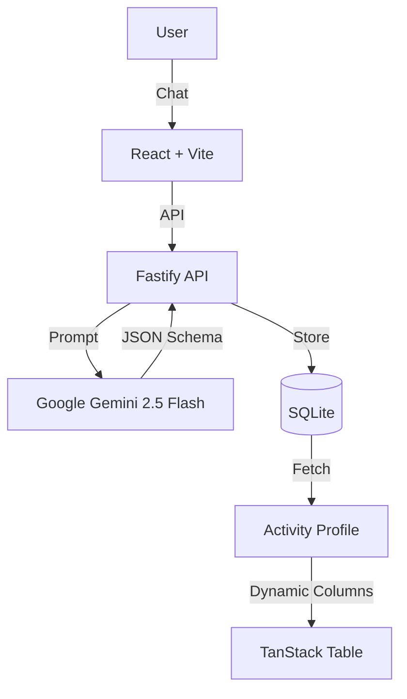

# Your Coach (powered by Google Gemini)


## 💡 Innovation: The "Meta-Coach"

Most AI coaching apps give you a generic chatbot. **Your Coach** is different.

It uses an advanced **Creation Agent** (powered by **Google Gemini 2.5 Flash**) to interview you, analyze your vague goals, and architect a **custom AI persona** with:
1.  **"Tracer Bullet" Experiments**: It breaks abstract goals ("Get fit") into tiny, measurable actions ("Walk 10m daily").
2.  **Data-Driven Custom Schema**: It designs a unique database schema (e.g., "Gap distance in cm" vs "Mood 1-5") tailored specifically for your habit.
3.  **Unique Personality**: From "Drill Sergeant" to "Empathetic Listener", it generates a bio and voice that motivates *you*.

## 🛠️ Technical Execution

We leveraged the full power of **Google Gemini 2.5 Flash** for high-speed, low-latency agent reasoning to generate complex JSON structures in real-time.

### Architecture



### Tech Stack
-   **AI**: Google Gemini 2.5 Flash (via `@google/genai`)
-   **Backend**: Fastify (Node.js), TypeScript, SQLite (`better-sqlite3`)
-   **Frontend**: React, Vite, Tailwind CSS, shadcn/ui, TanStack Table
-   **Key Feature**: Dynamic JSON-to-Table rendering for custom habit metrics.

## 🚀 Potential Impact

**The Problem**: 92% of New Year's resolutions fail because goals are too vague and feedback loops are too slow.
**The Solution**: By turning abstract goals into **measurable data points** and providing an **accountability partner (AI Coach)** that is available 24/7, we democratize elite-level coaching for everyone.

## ✨ Wow Factor: TBD


## 📦 Getting Started

### Prerequisites
-   Node.js v18+
-   Google Gemini API Key

### Installation

1.  **Clone & Install**
    ```bash
    git clone <repo>
    npm install       # Root (Frontend)
    cd server && npm install # Backend
    ```

2.  **Configure Backend**
    Create `server/.env`:
    ```env
    GOOGLE_API_KEY=your_gemini_key
    PORT=4000
    GOOGLE_CLIENT_ID=your_google_client_id
    ```

3.  **Start Development Servers**
    You need to run both concurrently:

    **Terminal 1: Backend**
    ```bash
    cd server && npm run dev
    # Server starts at http://localhost:4000
    ```

    **Terminal 2: Frontend**
    ```bash
    npm run dev
    # Frontend starts at http://localhost:5173
    ```

## 📜 License
MIT
