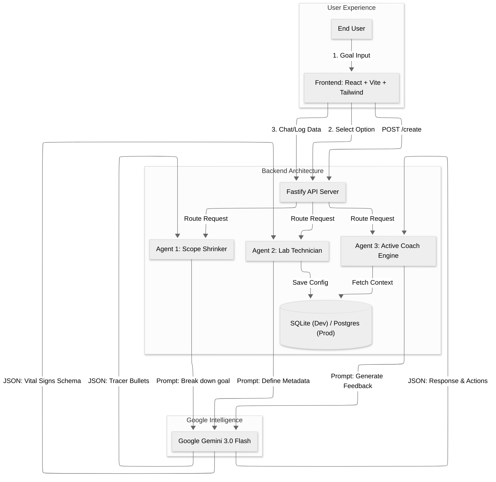

# Your Coach (Powered by Gemini 3.0)

**Your Coach** is an AI-native life coaching platform that doesn't just chat—it *architects* a custom coaching experience. Using a multi-agent system powered by **Google Gemini 3.0 Flash**, it transforms vague user goals into precise, data-driven tracking protocols and generates a unique AI persona to keep you accountable.

---

## 💡 Innovation: The "Meta-Coach" Architecture

Most AI coaching apps give you a generic chatbot. **Your Coach** is different. It uses a sophisticated **"Creation Agent"** pipeline to design the coach *for* you.

### The "Creation Agent" Workflow (Powered by Gemini 3.0)
1.  **Step 1: The Scope Shrinker**: Analyzes abstract goals (e.g., "Get fit") and breaks them down into "Tracer Bullet" experiments (e.g., "10m Walk" vs "50 Pushups").
2.  **Step 2: The Lab Technician**: Dynamically generates a **custom database schema** (Vital Signs) tailored to the activity. It decides if you should track "Gap distance in cm" or "Mood (1-5)" based on the context.
3.  **Step 3: The Architect of Encouragement**: Crafts a bespoke **AI Persona** (including bio, voice, and motto) that matches your specific motivation style.

---

## 🛠️ Technical Execution & Gemini 3.0 Integration

We leveraged the cutting-edge **Gemini 3.0 Flash** model to build a fast, reasoning-heavy backend that goes beyond simple text generation.

### System Architecture



### Key Technical Features
-   **Model**: Exclusively uses `gemini-3-flash-preview` via `@google/genai` SDK for sub-second latency and complex reasoning.
-   **Structured Intelligence**: Heavy reliance on `responseMimeType: 'application/json'` allows Gemini to control the UI directly—defining table columns, form inputs, and visualization types on the fly.
-   **Multi-Agent System**:
    -   **Intention Classifier**: Real-time routing of user messages between "Logging Mode" (data entry) and "Consulting Mode" (advice).
    -   **Insight Engine**: Analyzes historical log data to generate "Deep Dive" observations and specific "Next Actions".
    -   **Active Coach Engine**: Uses "Contextual Memory" to generate proactive greetings that reference your *specific* previous results (e.g., "How are those hips after the 15cm stretch?").

### Architecture Stack
-   **AI**: Google Gemini 3.0 Flash (`@google/genai`)
-   **Backend**: Fastify (Node.js), TypeScript, SQLite (Dev) / PostgreSQL (Prod)
-   **Frontend**: React, Vite, Tailwind CSS, shadcn/ui
-   **Data**: Dynamic JSON-to-Table rendering for custom habit metrics.

---

## 🚀 Potential Impact

**The Problem**: 92% of New Year's resolutions fail because goals are too vague ("Get healthy") and feedback loops are too slow.
**The Solution**: By turning abstract desires into **measurable data points** and providing an **accountability partner (AI Coach)** that is available 24/7, we democratize elite-level coaching. "Your Coach" solves the "Cold Start Problem" of habit tracking by doing the setup work for you.

---

## 📦 Getting Started

### Prerequisites
-   Node.js v18+
-   Google Gemini API Key

### Installation

1.  **Clone & Install**
    ```bash
    git clone <repo>
    npm install       # Install Frontend dependencies
    cd server && npm install # Install Backend dependencies
    ```

2.  **Configure Backend**
    Create `server/.env`:
    ```env
    GOOGLE_API_KEY=your_gemini_key
    PORT=4000
    ```

3.  **Start Development Servers**
    You need to run both concurrently:

    **Terminal 1: Backend**
    ```bash
    cd server && npm run dev
    # Server starts at http://localhost:4000
    ```

    **Terminal 2: Frontend**
    ```bash
    npm run dev
    # Frontend starts at http://localhost:5173
    ```

---

## 🤖 Built with AI

This project was developed during a hackathon to explore the future of **"vibe coding"**:

-   **Antigravity**: The entire development process was orchestrated by the Antigravity agent, allowing us to focus on high-level architecture and creative direction.
-   **Gemini 3.0**: Powers the core intelligence, from generating database schemas to roleplaying complex personas.
-   **Lovable**: Used for rapid prototyping of the initial UI components.

## 📜 License
MIT
